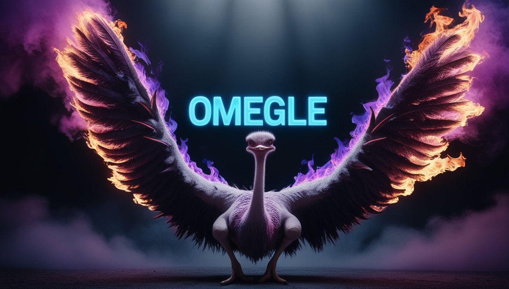

> "I am sought of them that asked not for me; I am found of them that sought me not: I said, Behold me, behold me, unto a nation that was not called by my name."
> Isaiah 65:1

# Omegle on Nostr
*don't thread on Omegle*

## NOT RELEASED YET
- [hosted in github pages](https://antonioconselheiro.github.io/omeglestr),
- [tor prod address](http://omegleau2uz72h5rmzm2vik5tgkcazsl5tfg7oafp4h3agbqomyvicqd.onion)

## Not the phoenix we want, the phonix we need.

## Implementation
It'll not need you `nsec` or connect to your signer, this will generate one nsec to each talk and in the end of each talk will clean all events emitted from your session. If the events are not deleted at the end, it'll expire into relay and be deleted anyway.
This also have a hardcoded relay included, no custom relays are need, if you want change it and find stranger to talk in other relays you must [fork](https://guides.github.com/activities/forking/) this repository by [clicking here](https://github.com/antonioconselheiro/omeglestr/fork).

## Relay Compatibility
Need support to [NIP-04](https://github.com/nostr-protocol/nips/blob/master/04.md), [NIP-38](https://github.com/nostr-protocol/nips/blob/master/38.md) and [NIP-40](https://github.com/nostr-protocol/nips/blob/master/40.md).

## TODO
- [ ] include "great talk?" button to export talk as html
- [ ] if relay has an onion url, in onion context the app should prefer that
- [ ] include button to app stop searching

## Donate
Do you want more protests in favor of free speech, freedom of software and freedom of work similar to this one?

This client nostr is a demonstration of a fraction of my power, as I have no funding other than my goodwill, with a contribution in satoshis you help me fund other products.

Any open source that has its code physically decentralized around the world is likely to be a perpetual service to every human being with access to technology.

There's still a lot of work to do.

Lighting donate: <a href="lightning:antonioconselheiro@getalby.com">lightning:antonioconselheiro@getalby.com</a>

Bitcoin onchain donate: <a href="bitcoin:bc1qrm99lmmpwk7zsh7njpgthw87yvdm38j2lzpq7q">bc1qrm99lmmpwk7zsh7njpgthw87yvdm38j2lzpq7q</a>

## Contribute
- See [CONTRIBUTE.md](./CONTRIBUTE.md)

## References
- https://angular.dev/style-guide#rule-of-one
- https://github.com/nostr-protocol/nips
- https://nostrify.dev/
- https://www.omegle.com/